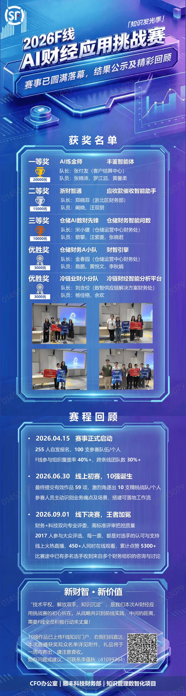
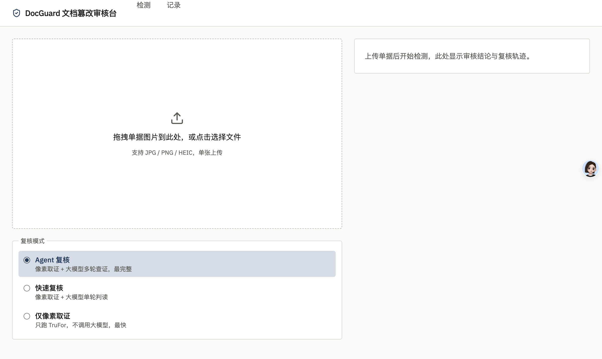

# DocGuard 丰鉴智能体 — AI 驱动的文档真伪审核系统

> 🏆 **2026F线AI财经应用挑战赛 · 一等奖(奖金 ¥20,000)**

## 比赛成绩

| 项 | 内容 |
|---|---|
| 赛事 | 2026F线AI财经应用挑战赛(2026.04 – 2026.09) |
| 成绩 | **一等奖**(¥20,000) |
| 战队 | AI炼金师 —— 队长：张付友(客户结算中心);队员：张锦添、罗江滔、黄馨柔 |
| 作品 | 丰鉴智能体(DocGuard) |

赛程：255 人自发报名、100 支队伍 → 59 项有效作品角逐 → 10 强进决赛 → 2026-09-01 线下决赛夺冠。

<p align="center">
  
</p>

## 项目简介

金融文档(合同、单据、函件)上传时的篡改检验系统。CV 工具做像素级取证,多模态大模型(VLM)做独立复核验证,输出财务人员可理解的审核意见与完整复核轨迹。



## 架构

```
上传单据图片(JPG/PNG/HEIC)
  → CV 像素取证:TruFor(Noiseprint++ 噪声指纹)→ 篡改分 + 热力图 + 候选区域
  → VLM 复核(三档模式):
      agent  — JSON 行动协议多轮 Loop,工具调用取证细节,最完整
      direct — 大模型单轮判读,快速复核
      cv     — 仅像素取证,不调大模型,最快
  → 输出:判定结论 + 热力图对比 + 语义化审核意见(SSE 实时推送复核轨迹)
```

## 技术栈

- **CV 检测层**: TruFor (CVPR 2023) — Noiseprint++ 噪声指纹取证;HiFi-Net (IFDL) 可选第二模型
- **VLM 复核层**: DashScope 百炼(默认)/ 任意 OpenAI 兼容网关 —— 双协议,改 `.env` 四个变量即切换,见 `deploy/README.md`
- **后端**: FastAPI(SSE 检测流 + REST 记录,检测与推送解耦)
- **前端**: React 19 + Vite + Tailwind 4(legacy Gradio 版 `app.py` 仍保留)
- **运行环境**: Mac(MPS)/ Windows + NVIDIA 一键部署(`deploy.bat`,注册 Windows 服务)
- **Python**: 3.10+

## 快速开始

```bash
git clone https://github.com/mychnfk/doc-tamper-detection.git
cd doc-tamper-detection

python -m venv .venv && source .venv/bin/activate   # Windows: .venv\Scripts\activate
pip install -r requirements.txt

# 外部模型权重需单独获取(见 .gitignore 注释):TruFor/、HiFi_IFDL/

cd web && npm install && npm run build && cd ..     # 构建前端
./start-web.sh                                       # FastAPI + React(主用)
# ./start.sh                                        # Gradio legacy 版
```

Windows 生产部署(双击 `deploy.bat` 全自动)见 `deploy/README.md`。

## 项目状态

- [x] 技术调研(详见 `调研记录.md`)
- [x] TruFor 像素取证集成 + 评测集校准
- [x] VLM 复核层(Agent Loop + 直链回退,双协议)
- [x] React + FastAPI 前端重写
- [x] Windows 一键部署
- [x] 2026-09-01 决赛一等奖收官,仓库开源存档

## 文件结构

```
doc-tamper-detection/
├── api.py            # FastAPI 主服务(检测 SSE + 记录 REST)
├── agent.py          # VLM 复核层:JSON 行动协议 Loop
├── pipeline.py       # 检测流水线编排
├── run_inference.py  # TruFor 单图推理
├── web/              # React 前端
├── deploy/           # Windows 一键部署(deploy.bat + nssm)
├── scripts/          # 评测/造样工具(灰区造样、印章替换、批量评分)
├── docs/             # 开发日志、演示剧本、QA 预案、截图
├── 调研记录.md        # 完整技术调研 & 比赛方案
└── app.py            # Gradio legacy 版
```

## LICENSE

[MIT](LICENSE)
